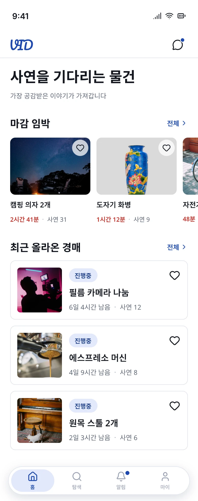
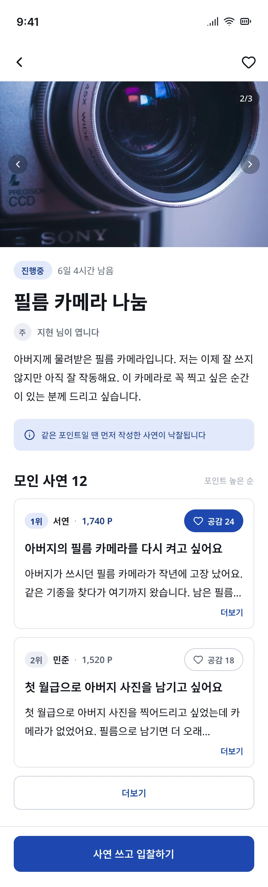
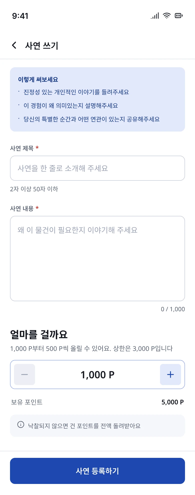
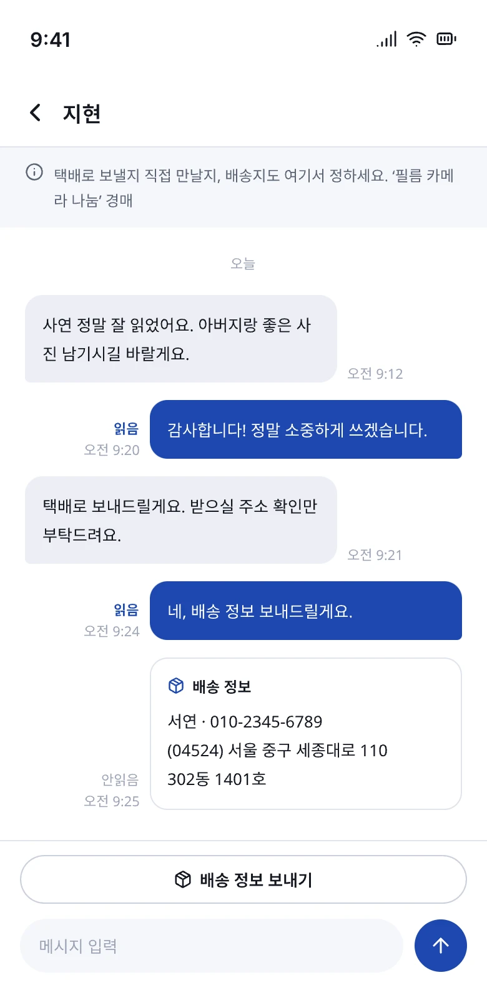
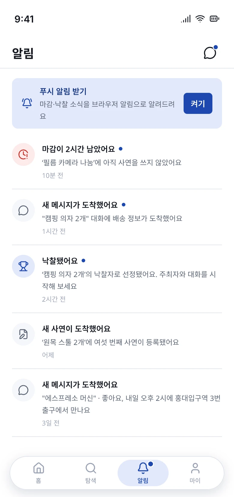
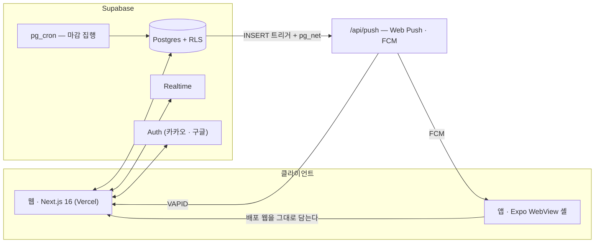

# Vidding

**돈이 아니라 사연으로 입찰하는 경매 플랫폼.**

가장 높은 금액을 부른 사람이 아니라, 가장 공감받은 이야기를 쓴 사람이 낙찰받는다.


[](https://github.com/seokachu/vidding-re/releases/latest/download/vidding.apk)

| 구분 | 일반 경매 | Vidding |
|---|---|---|
| 입찰 수단 | 금액 | 사연(스토리) |
| 낙찰 기준 | 최고가 | 사연이 받은 공감 |
| 참여 경험 | 가격 경쟁 | 이야기 공유·공감 |

**바로 보기** — [서비스](https://vidding-re.vercel.app) · [기능명세서](https://vidding-re.vercel.app/docs) · [디자인 시안](https://vidding-re.vercel.app/docs/design) · [스토리북](https://vidding-storybook.vercel.app) · [앱 다운로드](#앱-다운로드)

---

## 화면

<p>
  
  
  
  
  
</p>

전체 시안은 [디자인 시안 (웹)](https://vidding-re.vercel.app/docs/design)에서 —
화면 29장과 디자인 시스템 4장을 배포된 서비스 안에서 그대로 열람할 수 있다.

---

## 주요 기능

**경매 · 사연 · 포인트**
- 사연으로 입찰하고, 공감(주최자 +50 P · 그 외 +10 P)이 낙찰을 가른다
- 포인트는 입찰에 걸고, 미낙찰·유찰·사연 삭제 시 전액 반환된다
- `pg_cron` 이 1분마다 마감을 집행한다 — 낙찰 산정·유찰·포인트 정산이 자동이다
- 마감 임박 알림은 경매 기간에 비례한 3단계로 온다

**실시간 (Supabase Realtime)**
- 낙찰자↔주최자 1:1 채팅 — 읽음/안읽음 표시, 재연결 시 놓친 메시지 자동 복구,
  전송 실패 시 재전송, 배송 정보는 말풍선이 아닌 카드로
- 실시간 이벤트에도 RLS 가 그대로 적용된다 — 참여자만 수신한다
- 새 알림이 오면 새로고침 없이 하단 탭 배지가 켜진다

**푸시 알림 (웹 + 앱)**
- 브라우저는 Web Push(VAPID), 하이브리드 앱은 FCM(Expo) — 같은 알림이 두 경로로 나간다
- DB INSERT 트리거가 `pg_net` 으로 발송 API 를 호출한다 — 클라이언트를 거치지 않는다
- 지금 보고 있는 채팅방의 알림은 무음, 대화 알림은 방마다 최신 한 줄로 합쳐진다
- 알림을 누르면 웹·앱 모두 해당 화면으로 바로 열린다

**하이브리드 앱 (Expo)**
- 배포된 웹을 그대로 담는 WebView 셸 — 네이티브가 해야만 하는 일만 셸이 맡는다
- 세션 유지, 외부 앱 스킴 열기, 당겨서 새로고침(채팅방은 예외), 로드 실패 재시도
- Android 뒤로가기는 웹 히스토리를 따라가고, 첫 화면에서는 두 번 눌러 종료한다
- 키보드가 뜨면 셸이 WebView 를 직접 줄인다 — 엣지투엣지에서도 입력줄이 가려지지 않는다

**앱 설치 (PWA)**
- APK 없이도 웹을 홈 화면에 앱처럼 설치한다 — 배너가 유도하고, 크로미움은 네이티브
  프롬프트 · iOS 는 "공유 → 홈 화면에 추가" 가이드로 갈린다
- 설치된 앱은 잉크 블루 스플래시(로고 + 태그라인)로 뜬다 — iOS 기기별 17장, 안드로이드는 자동 생성

**관계 기반 UI**
- 사용자를 역할로 나누지 않는다. 경매마다 **주최자 / 참여자 / 방문자 / 비회원** 관계를
  판정해 버튼과 화면이 달라진다 — 토글 전환이 없다

**인증 · 보안**
- 카카오/구글 소셜 로그인, 아바타·닉네임은 마지막 로그인 제공자를 따라간다
- 모든 테이블에 RLS — 권한 판정은 클라이언트가 아니라 DB 가 한다

**디자인 시스템**
- 잉크 블루 단일 테마 · Pretendard · 390px 기준, `.pen` 시안과 코드가 1:1 로 맞다
- 공통 UI 20종을 [스토리북](https://vidding-storybook.vercel.app)으로 문서화했다

---

## 구조



---

## 앱 다운로드


Android 폰 카메라로 QR 을 찍거나, 아래 링크로 받는다.

**[⬇ vidding.apk 다운로드](https://vidding-re.vercel.app/download)**

- 배포된 웹을 담는 하이브리드 앱이라, 웹이 갱신되면 앱도 재설치 없이 함께 갱신된다
- 설치 시 "출처를 알 수 없는 앱" 허용이 필요하다 (스토어 외 배포)
- 링크는 다운로드 페이지(`/download`)를 거친다 — 카카오톡 등 **인앱 브라우저는 APK 설치가
  막히므로** 감지해서 외부 브라우저로 자동 전환한다

<br clear="right" />

---

## 이 프로젝트

기존 서비스의 기획과 디자인을 참고해 **새로 만드는 개인 프로젝트**다.

기존 서비스는 사용자를 **경매진행자**와 **입찰참여자**로 나누고 헤더 토글로 전환하게 했다.
같은 사람인데도 **토글을 바꿔야 버튼이 눌렸다.**

> 신분(내가 누구인가)이 아니라 **관계(이 경매와 나는 어떤 사이인가)** 로 판단한다.

| 관계 | 조건 |
|---|---|
| **주최자** | 내가 등록한 경매 |
| **참여자** | 내가 사연을 쓴 경매 |
| **방문자** | 로그인했지만 위 둘 다 아님 |
| **비회원** | 미로그인 |

관계는 계정 속성이 아니라 **경매마다 따로** 정해진다. 사용자가 선언하지 않는다.

---

## 핵심 규칙

**낙찰**

```
최종 점수 = 본인이 건 포인트 + 받은 공감 가중치
동점이면 → 먼저 작성한 사연
```

**입찰** — ＋/− 버튼으로만 조작한다. 숫자를 직접 입력하지 않는다.

```
1,000 → 1,500 → 2,000 → 2,500 → 3,000
```

**공감** — 주최자 `+50 P` · 그 외 `+10 P`
주최자가 결과에 개입하는 수단은 공감 하나뿐이다.

**포인트** — 물건을 나누면 얻고, 물건을 받으면 쓴다.

| 흐름 | 내용 |
|---|---|
| 가입 | +5,000 P (1회) |
| 입찰 | 차감 |
| 미낙찰 · 유찰 · 사연 삭제 | 전액 반환 |
| 낙찰 | 낙찰자 → **주최자에게 이전** |

**채팅** — 낙찰 이후 주최자와 낙찰자 사이에서만 열린다.

---

## 문서

| 문서 | 내용 |
|---|---|
| [기능명세서 (웹)](https://vidding-re.vercel.app/docs) | 아래 기획 문서를 배포된 화면에서 읽는다 |
| [디자인 시안 (웹)](https://vidding-re.vercel.app/docs/design) | `.pen` 화면 27장 · 디자인 시스템 4장 |
| [스토리북](https://vidding-storybook.vercel.app) | UI 컴포넌트 카탈로그 |
| [기획 전체](./docs/README.md) | 인덱스 · 핵심 규칙 · 단순화 원칙 |
| [PRD](./docs/PRD.md) | 배경 · 문제 · 목표 · 사용자 · 기능 · 시나리오 · MVP 범위 |
| [데이터 모델](./docs/데이터-모델-명세.md) | 테이블 · RLS · 고정 상수 |
| [기능 스펙](./docs/specs/README.md) | 기능별 상세 13개 |
| [코드 구조](./docs/구조.md) | 폴더 구조 · 관계 판정 · 토큰 사용법 |
| [Supabase](./supabase/README.md) | 마이그레이션 · 인증 설정 · 검증 결과 |

---

## 기술 스택

| 구분 | 사용 |
|---|---|
| Framework | Next.js 16 (App Router) |
| Language | TypeScript |
| Styling | Tailwind CSS 4 |
| Backend | Supabase (DB · 인증 · Realtime · pg_cron) |
| Push | Web Push(VAPID) · FCM(Expo) |
| App | Expo (React Native WebView 셸) |
| Docs | Storybook · Pencil(.pen) |

---

## 시작하기

```bash
pnpm install
cp .env.example .env.local     # Supabase 키를 채운다
pnpm dev
```

http://localhost:3000

**더미 데이터** — 마감·낙찰·유찰까지 실제 흐름대로 만든다.
`SUPABASE_SERVICE_ROLE_KEY` 가 있어야 한다.

> 돌리기 전에 **대시보드에서 이메일 제공자를 켠다.** 시드는 계정마다 이메일로
> 로그인해 RLS 를 그대로 통과하는데, 서비스는 소셜 둘만 제공해서 (F10 3.1)
> 평소엔 꺼 둔다. **끝나면 다시 끈다.** 자세한 이유는 `scripts/seed.mjs` 머리말에.

```bash
pnpm seed            # 이미 있으면 건너뛴다
pnpm seed --clean    # 지우고 다시 만든다
```

---

## 라이선스

[MIT](./LICENSE)
